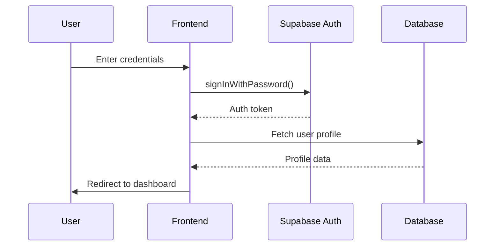
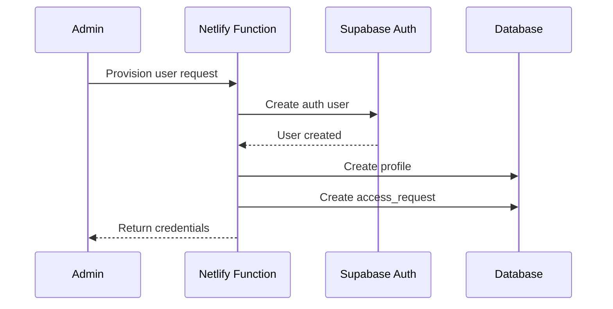

# Authentication & Security Architecture

## Overview

Citebots uses Supabase Auth for authentication with custom provisioning logic and Row Level Security (RLS) for data protection. This document outlines the current authentication flow and security patterns.

## Authentication Flow

### 1. Login Flow



**Implementation**:
```javascript
// Frontend login
const { data, error } = await supabase.auth.signInWithPassword({
  email: email,
  password: password
});

// Fetch profile
const { data: profile } = await supabase
  .from('profiles')
  .select('*')
  .eq('id', data.user.id)
  .single();
```

### 2. User Provisioning Flow



**Netlify Function**: `/netlify/functions/auth-provision.js`
- Creates user in Supabase Auth
- Generates secure password
- Creates profile record
- Records in access_requests table

### 3. Session Management

Supabase handles session management automatically:
- JWT tokens stored in localStorage
- Auto-refresh on expiry
- Secure HTTP-only cookies option available

```javascript
// Check session
const { data: { session } } = await supabase.auth.getSession();

// Listen for auth changes
supabase.auth.onAuthStateChange((event, session) => {
  if (event === 'SIGNED_IN') {
    // Handle sign in
  } else if (event === 'SIGNED_OUT') {
    // Handle sign out
  }
});
```

## User Roles & Permissions

### Role Hierarchy

1. **super_admin**
   - Full system access
   - Can manage all clients
   - Can provision users
   - Access to all features

2. **partner**
   - Can manage multiple clients
   - Limited admin features
   - Can view analytics

3. **client**
   - Single client access
   - Can run analyses
   - Can view own reports

4. **analyst**
   - Read-only access
   - Can view reports
   - Cannot modify data

### Role-Based Access Control (RBAC)

```sql
-- Check user role
CREATE OR REPLACE FUNCTION check_user_role(required_role TEXT)
RETURNS BOOLEAN AS $$
BEGIN
  RETURN EXISTS (
    SELECT 1 FROM profiles
    WHERE id = auth.uid()
    AND role = required_role
  );
END;
$$ LANGUAGE plpgsql SECURITY DEFINER;
```

## Row Level Security (RLS)

### Core Principles

1. **Enable RLS on all tables**
2. **Default deny all access**
3. **Explicitly grant permissions**
4. **Use auth.uid() for user identification**
5. **Service role bypass for edge functions**

### Common RLS Patterns

#### 1. User-Owned Resources
```sql
-- Users can view their own data
CREATE POLICY "Users view own data"
  ON table_name
  FOR SELECT
  USING (user_id = auth.uid());

-- Users can create their own data
CREATE POLICY "Users create own data"
  ON table_name
  FOR INSERT
  WITH CHECK (user_id = auth.uid());
```

#### 2. Role-Based Access
```sql
-- Super admins can access everything
CREATE POLICY "Super admin access"
  ON table_name
  FOR ALL
  USING (
    EXISTS (
      SELECT 1 FROM profiles
      WHERE id = auth.uid()
      AND role = 'super_admin'
    )
  );
```

#### 3. Related Resource Access
```sql
-- Access based on parent relationship
CREATE POLICY "Access via parent"
  ON child_table
  FOR SELECT
  USING (
    EXISTS (
      SELECT 1 FROM parent_table
      WHERE parent_table.id = child_table.parent_id
      AND parent_table.user_id = auth.uid()
    )
  );
```

#### 4. Service Role Bypass
```sql
-- Edge functions full access
CREATE POLICY "Service role bypass"
  ON table_name
  FOR ALL
  USING (auth.role() = 'service_role');
```

### RLS Best Practices

1. **Test policies thoroughly**
   - Use different user roles
   - Test edge cases
   - Verify no data leaks

2. **Keep policies simple**
   - Avoid complex joins
   - Minimize recursion
   - Use indexes effectively

3. **Document policies**
   - Comment policy purpose
   - Note any exceptions
   - Track policy changes

## API Security

### Edge Function Security

Edge functions use service role for database access:

```typescript
// Edge function authentication
const supabaseClient = createClient(
  Deno.env.get('SUPABASE_URL') ?? '',
  Deno.env.get('SUPABASE_SERVICE_ROLE_KEY') ?? '',
  {
    global: {
      headers: { Authorization: req.headers.get('Authorization')! },
    },
  }
);
```

### API Authentication

All API calls require authentication:

```javascript
// Frontend API calls
const response = await fetch(`${SUPABASE_URL}/functions/v1/analyze-citation`, {
  method: 'POST',
  headers: {
    'Authorization': `Bearer ${supabase.auth.session().access_token}`,
    'Content-Type': 'application/json'
  },
  body: JSON.stringify(data)
});
```

### Rate Limiting

Implemented at multiple levels:
1. Supabase built-in rate limits
2. Edge function custom delays
3. Frontend request throttling

```typescript
// Edge function rate limiting
const RATE_LIMIT_DELAY = 2000; // 2 seconds
await new Promise(resolve => setTimeout(resolve, RATE_LIMIT_DELAY));
```

## Security Best Practices

### 1. Environment Variables

```bash
# Never commit these
SUPABASE_SERVICE_KEY=...  # Backend only
OPENAI_API_KEY=...        # Backend only

# Safe for frontend
NUXT_PUBLIC_SUPABASE_URL=...
NUXT_PUBLIC_SUPABASE_ANON_KEY=...
```

### 2. Input Validation

Always validate inputs in edge functions:

```typescript
// Input validation example
function validateInput(data: any): ValidationResult {
  if (!data.clientId || typeof data.clientId !== 'string') {
    return { valid: false, error: 'Invalid clientId' };
  }
  
  if (!data.queries || !Array.isArray(data.queries)) {
    return { valid: false, error: 'Invalid queries array' };
  }
  
  return { valid: true };
}
```

### 3. Error Handling

Never expose sensitive information in errors:

```typescript
try {
  // Operation
} catch (error) {
  console.error('Operation failed:', error);
  return new Response(
    JSON.stringify({ error: 'Operation failed' }),
    { status: 500 }
  );
}
```

### 4. SQL Injection Prevention

Use parameterized queries:

```typescript
// Safe query
const { data, error } = await supabase
  .from('clients')
  .select('*')
  .eq('id', clientId);

// Never do this
const query = `SELECT * FROM clients WHERE id = '${clientId}'`;
```

### 5. CORS Configuration

Configure CORS for production:

```typescript
// Edge function CORS
const corsHeaders = {
  'Access-Control-Allow-Origin': 'https://citebots.com',
  'Access-Control-Allow-Headers': 'authorization, x-client-info, apikey',
};
```

## Security Checklist

### Development
- [ ] Use environment variables for secrets
- [ ] Test RLS policies with different roles
- [ ] Validate all inputs
- [ ] Handle errors gracefully
- [ ] Use HTTPS for all requests

### Deployment
- [ ] Rotate API keys regularly
- [ ] Monitor for suspicious activity
- [ ] Keep dependencies updated
- [ ] Review security logs
- [ ] Test authentication flows

### Code Review
- [ ] No hardcoded secrets
- [ ] Proper input validation
- [ ] Secure database queries
- [ ] Error messages don't leak info
- [ ] RLS policies are correct

## Incident Response

### Security Incident Steps

1. **Identify**: Detect the security issue
2. **Contain**: Limit the damage
3. **Investigate**: Find root cause
4. **Remediate**: Fix the vulnerability
5. **Document**: Record lessons learned

### Common Vulnerabilities

1. **Exposed API Keys**
   - Rotate immediately
   - Check for unauthorized usage
   - Update deployment

2. **RLS Policy Bypass**
   - Fix policy immediately
   - Audit data access
   - Review all policies

3. **Authentication Issues**
   - Force password resets
   - Review session management
   - Check auth logs

## Monitoring & Auditing

### What to Monitor

1. **Authentication Events**
   - Failed login attempts
   - Password resets
   - New user creation

2. **API Usage**
   - Unusual patterns
   - Rate limit hits
   - Error rates

3. **Database Access**
   - Query patterns
   - Data modifications
   - Policy violations

### Audit Logs

Maintain logs for:
- User authentication
- Data modifications
- Admin actions
- API calls
- Security events

## Future Security Enhancements

1. **Multi-Factor Authentication (MFA)**
2. **API Key Management System**
3. **Advanced Rate Limiting**
4. **Security Headers Enhancement**
5. **Automated Security Scanning**
6. **Penetration Testing**
7. **SOC 2 Compliance**