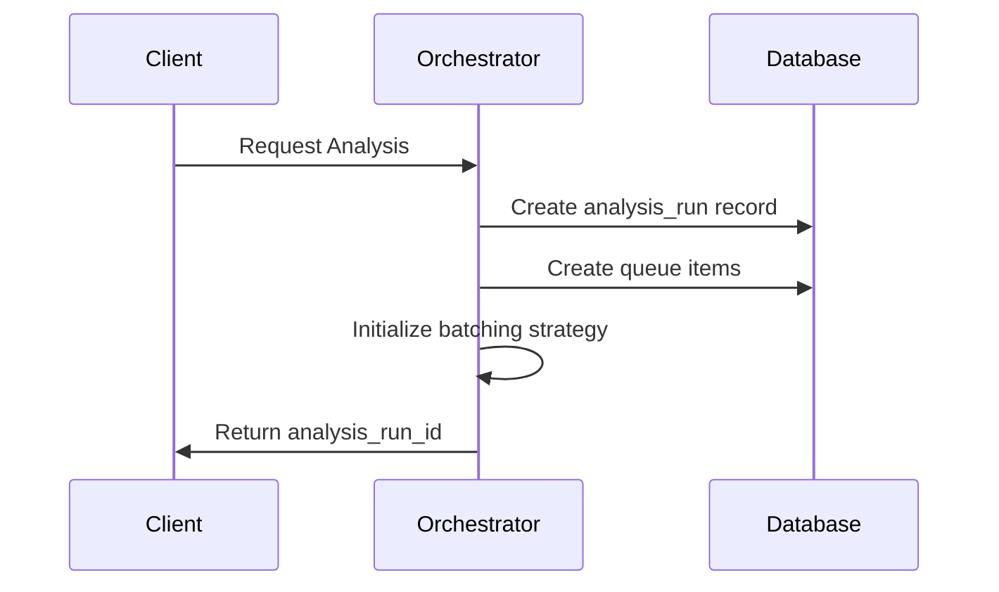
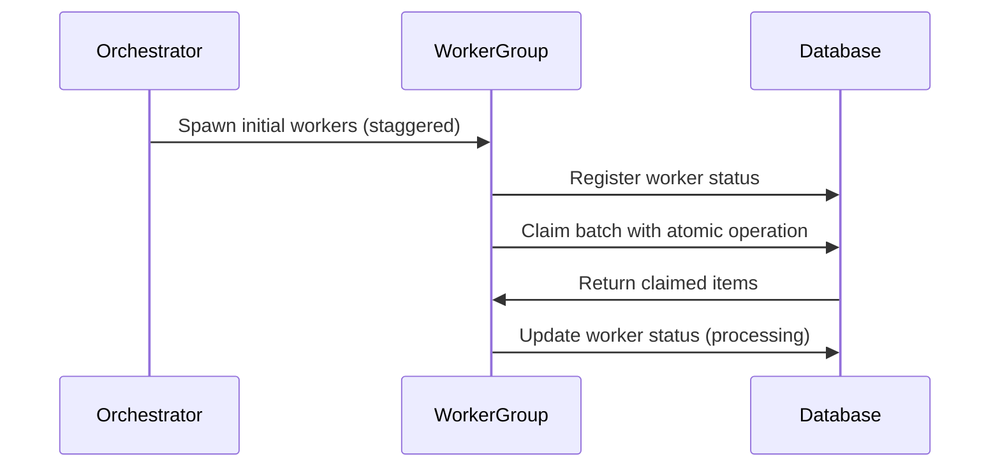
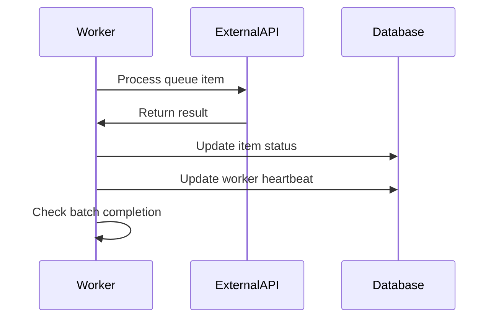
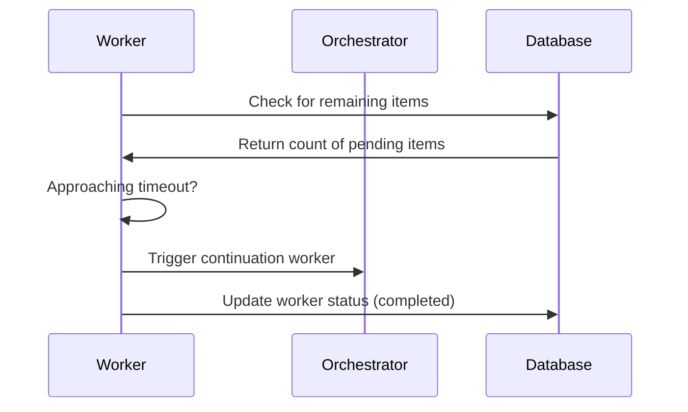
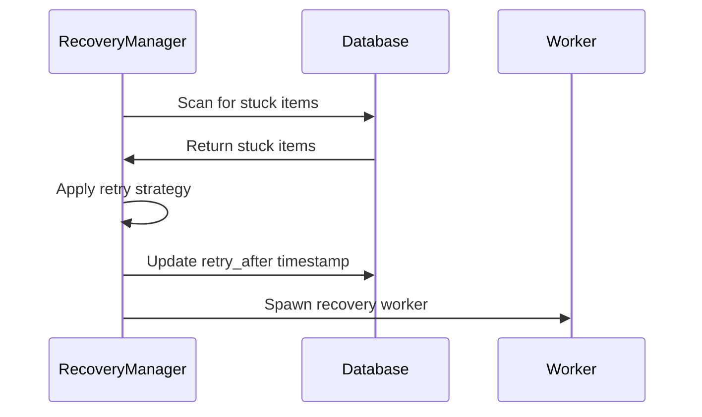

# Queue System Architecture Design

This document outlines the design for an improved queue system architecture for the Citebots platform. The design addresses the reliability and scalability issues identified in the current implementation while maintaining compatibility with Supabase Edge Functions.

## Current System Limitations

The current queue system suffers from several limitations:

1. **Unreliable Continuation**: Workers stop processing after handling ~47 items
2. **Resource Contention**: Multiple workers compete for resources
3. **Error Recovery Gaps**: Inconsistent handling of failed items
4. **Monitoring Deficiencies**: Limited visibility into processing status
5. **Timeout Constraints**: Edge function timeout limitations (25-30 seconds)

## Design Goals

The redesigned queue system aims to achieve:

1. **Reliability**: Ensure all queued items are processed to completion
2. **Resilience**: Recover gracefully from failures and timeouts
3. **Observability**: Provide comprehensive monitoring and reporting
4. **Efficiency**: Optimize resource utilization and throughput
5. **Maintainability**: Simplify code structure and error handling

## System Architecture

### High-Level Architecture

The improved queue system uses a multi-tier architecture:

1. **Orchestration Tier**: Manages the overall analysis workflow
2. **Worker Tier**: Processes individual queue items
3. **Monitoring Tier**: Tracks progress and handles reporting
4. **Recovery Tier**: Handles error conditions and retries

### System Components


1. **Queue Orchestrator**
   - Initiates queue processing
   - Manages worker spawning strategy
   - Tracks overall progress
   - Implements staggered worker initialization

2. **Queue Workers**
   - Process batches of queue items
   - Implement self-healing continuation
   - Handle individual item processing
   - Report progress and status

3. **Recovery Manager**
   - Detects and reprocesses failed items
   - Implements exponential backoff for retries
   - Manages dead letter queue for persistent failures
   - Provides manual intervention interfaces

4. **Monitoring Dashboard**
   - Displays real-time processing status
   - Shows error rates and patterns
   - Provides drill-down for detailed status
   - Enables manual intervention for stuck items

### Database Schema

The database schema will be enhanced with additional fields:

```sql
-- Enhanced analysis_queue table
CREATE TABLE IF NOT EXISTS public.analysis_queue (
  id UUID PRIMARY KEY DEFAULT uuid_generate_v4(),
  analysis_run_id UUID REFERENCES public.analysis_runs(id),
  query_id UUID,
  status TEXT DEFAULT 'pending',
  created_at TIMESTAMP WITH TIME ZONE DEFAULT NOW(),
  updated_at TIMESTAMP WITH TIME ZONE DEFAULT NOW(),
  processor_id UUID, 
  attempts INTEGER DEFAULT 0,
  max_attempts INTEGER DEFAULT 3,
  error TEXT,
  
  -- New fields for enhanced queue system
  last_error_timestamp TIMESTAMP WITH TIME ZONE,
  retry_after TIMESTAMP WITH TIME ZONE,
  processing_time_ms INTEGER,
  priority INTEGER DEFAULT 0,
  worker_group TEXT,
  batch_id UUID,
  checkpoint_data JSONB,
  recovery_attempts INTEGER DEFAULT 0
);

-- Tracking table for worker status
CREATE TABLE IF NOT EXISTS public.worker_status (
  id UUID PRIMARY KEY DEFAULT uuid_generate_v4(),
  worker_id UUID,
  worker_type TEXT,
  status TEXT,
  last_heartbeat TIMESTAMP WITH TIME ZONE DEFAULT NOW(),
  items_processed INTEGER DEFAULT 0,
  errors_encountered INTEGER DEFAULT 0,
  started_at TIMESTAMP WITH TIME ZONE DEFAULT NOW(),
  completed_at TIMESTAMP WITH TIME ZONE,
  batch_id UUID,
  metadata JSONB
);

-- Dead letter queue for persistently failed items
CREATE TABLE IF NOT EXISTS public.dead_letter_queue (
  id UUID PRIMARY KEY DEFAULT uuid_generate_v4(),
  original_queue_id UUID REFERENCES public.analysis_queue(id),
  analysis_run_id UUID REFERENCES public.analysis_runs(id),
  error TEXT,
  error_count INTEGER,
  last_error_timestamp TIMESTAMP WITH TIME ZONE DEFAULT NOW(),
  metadata JSONB,
  resolution_status TEXT DEFAULT 'unresolved',
  resolution_notes TEXT
);
```

## Processing Flow

### 1. Initialization Phase



1. Client requests analysis with queries
2. Orchestrator creates an analysis_run record
3. Orchestrator creates queue items for each query
4. Orchestrator determines optimal batching strategy
5. Client receives analysis_run_id for tracking

### 2. Worker Initialization Phase



1. Orchestrator spawns initial workers with staggered starts
2. Each worker registers its status in worker_status table
3. Workers claim batches using atomic database operations
4. Database returns claimed items to appropriate workers
5. Workers update their status to "processing"

### 3. Processing Phase



1. Worker processes each queue item through external APIs
2. Worker receives results and updates item status
3. Worker regularly updates its heartbeat in worker_status
4. Worker tracks progress through its assigned batch
5. Worker implements checkpoint saving for partial progress

### 4. Continuation Phase



1. Worker checks for remaining pending items
2. If items remain and timeout approaches (20s mark of 25s timeout)
3. Worker triggers continuation worker with progress data
4. Continuation worker starts with staggered delay
5. Original worker completes its batch and updates status

### 5. Recovery Phase



1. Recovery manager scans for stuck items (no updates in 5 minutes)
2. Recovery manager applies exponential backoff strategy
3. Recovery manager updates retry_after timestamp
4. Recovery manager spawns dedicated recovery workers
5. For persistently failing items, move to dead_letter_queue

## Implementation Details

### Queue Orchestrator

The Queue Orchestrator manages the overall analysis process:

```typescript
// queue-orchestrator.ts
export async function orchestrateAnalysis(req: Request) {
  const { client_id, queries, options } = await req.json();
  
  // Create analysis run
  const { data: analysisRun, error } = await supabase
    .from('analysis_runs')
    .insert({
      client_id,
      status: 'processing',
      created_by: user.id,
      total_queries: queries.length,
      processed_queries: 0
    })
    .select()
    .single();
  
  if (error) throw new Error(`Failed to create analysis run: ${error.message}`);
  
  // Create queue items
  const queueItems = queries.map((query, index) => ({
    analysis_run_id: analysisRun.id,
    query_id: query.id,
    status: 'pending',
    priority: calculatePriority(query, index),
    worker_group: assignWorkerGroup(query)
  }));
  
  await supabase.from('analysis_queue').insert(queueItems);
  
  // Spawn initial workers with staggered start
  const batchSize = determineBatchSize(queries.length);
  const workerCount = Math.min(5, Math.ceil(queries.length / batchSize));
  
  for (let i = 0; i < workerCount; i++) {
    // Stagger worker starts to prevent resource contention
    setTimeout(() => {
      spawnWorker(analysisRun.id, {
        batch_size: batchSize,
        worker_index: i,
        worker_group: 'initial'
      });
    }, i * 2000); // 2-second stagger between workers
  }
  
  return {
    success: true,
    analysis_run_id: analysisRun.id,
    total_queries: queries.length,
    estimated_completion_time: estimateCompletionTime(queries.length)
  };
}
```

### Queue Worker

The Queue Worker processes batches of items:

```typescript
// queue-worker.ts
export async function processQueueBatch(req: Request) {
  const { analysis_run_id, batch_size = 5, worker_index = 0, worker_group = 'standard' } = await req.json();
  
  // Register worker
  const workerId = crypto.randomUUID();
  await registerWorker(workerId, worker_group, analysis_run_id);
  
  // Claim batch
  const claimedItems = await claimBatch(analysis_run_id, workerId, batch_size);
  if (claimedItems.length === 0) {
    await completeWorker(workerId, 0);
    return { success: true, items_processed: 0, status: 'no_work' };
  }
  
  // Process items
  let processedCount = 0;
  let errorCount = 0;
  let checkpointData = {};
  
  try {
    for (const item of claimedItems) {
      // Update heartbeat regularly
      if (processedCount % 2 === 0) {
        await updateWorkerHeartbeat(workerId, processedCount, errorCount);
      }
      
      // Check for timeout approach (20s of 25s timeout)
      const elapsedTime = Date.now() - startTime;
      if (elapsedTime > 20000 && processedCount < claimedItems.length - 1) {
        // Save checkpoint and spawn continuation worker
        checkpointData = { 
          last_processed_index: processedCount,
          remaining_items: claimedItems.length - processedCount - 1
        };
        
        await spawnContinuationWorker(analysis_run_id, worker_group, checkpointData);
        break;
      }
      
      // Process the item
      try {
        await processItem(item);
        processedCount++;
      } catch (error) {
        await handleItemError(item, error, workerId);
        errorCount++;
      }
    }
  } finally {
    // Always update worker status on completion
    await completeWorker(workerId, processedCount, errorCount, checkpointData);
  }
  
  // Check for more work and spawn continuation if needed
  const { count: remainingItems } = await supabase
    .from('analysis_queue')
    .select('id', { count: 'exact', head: true })
    .eq('analysis_run_id', analysis_run_id)
    .eq('status', 'pending');
  
  if (remainingItems > 0) {
    // Spawn new worker with staggered delay
    setTimeout(() => {
      spawnWorker(analysis_run_id, {
        batch_size,
        worker_index: worker_index + 1,
        worker_group
      });
    }, 1000); // 1-second delay to prevent immediate respawn
  }
  
  return {
    success: true,
    items_processed: processedCount,
    errors: errorCount,
    checkpoint_data: checkpointData,
    remaining_items: remainingItems
  };
}
```

### Recovery Manager

The Recovery Manager handles error recovery:

```typescript
// recovery-manager.ts
export async function recoverStuckItems(req: Request) {
  const { threshold_minutes = 5 } = await req.json();
  
  // Find stuck items (status = 'processing' but no updates)
  const thresholdTime = new Date();
  thresholdTime.setMinutes(thresholdTime.getMinutes() - threshold_minutes);
  
  const { data: stuckItems } = await supabase
    .from('analysis_queue')
    .select('*')
    .eq('status', 'processing')
    .lt('updated_at', thresholdTime.toISOString());
  
  if (!stuckItems || stuckItems.length === 0) {
    return { success: true, recovered_items: 0 };
  }
  
  // Group by analysis_run_id for efficient processing
  const itemsByRun = stuckItems.reduce((acc, item) => {
    acc[item.analysis_run_id] = acc[item.analysis_run_id] || [];
    acc[item.analysis_run_id].push(item);
    return acc;
  }, {});
  
  let recoveredCount = 0;
  let deadLetterCount = 0;
  
  // Process each group
  for (const [runId, items] of Object.entries(itemsByRun)) {
    for (const item of items) {
      const attempts = (item.attempts || 0) + 1;
      
      if (attempts > item.max_attempts) {
        // Move to dead letter queue
        await moveToDeadLetterQueue(item);
        deadLetterCount++;
      } else {
        // Calculate backoff time (exponential)
        const backoffMinutes = Math.pow(2, attempts - 1) * 5; // 5, 10, 20, 40 minutes
        const retryAfter = new Date();
        retryAfter.setMinutes(retryAfter.getMinutes() + backoffMinutes);
        
        // Reset for retry
        await supabase
          .from('analysis_queue')
          .update({
            status: 'pending',
            attempts,
            retry_after: retryAfter.toISOString(),
            processor_id: null,
            last_error_timestamp: new Date().toISOString(),
            error: `Auto-recovered after ${threshold_minutes} minutes of inactivity`
          })
          .eq('id', item.id);
        
        recoveredCount++;
      }
    }
    
    // Spawn recovery worker for this run
    spawnRecoveryWorker(runId);
  }
  
  return {
    success: true,
    recovered_items: recoveredCount,
    dead_letter_items: deadLetterCount,
    runs_affected: Object.keys(itemsByRun).length
  };
}
```

## Monitoring and Observability

The improved system includes comprehensive monitoring:

### Dashboard Components

1. **Queue Status Overview**
   - Total items by status (pending, processing, completed, error)
   - Processing rate (items/minute)
   - Estimated completion time
   - Error rate and patterns

2. **Worker Status Panel**
   - Active workers count
   - Worker health status
   - Items processed per worker
   - Worker lifespan statistics

3. **Error Analysis View**
   - Error categorization
   - Retry statistics
   - Dead letter queue contents
   - Manual intervention options

### Telemetry Collection

The system collects detailed telemetry:

1. **Performance Metrics**
   - Processing time per item
   - Worker efficiency (items/second)
   - API call latency
   - Database operation timing

2. **Error Telemetry**
   - Error categorization
   - Error stack traces
   - Contextual information
   - Recovery attempt results

3. **Resource Utilization**
   - Edge function execution time
   - Memory usage patterns
   - Database connection utilization
   - External API usage rates

## Testing Strategy

The testing strategy ensures reliability:

1. **Unit Tests**
   - Test worker claiming logic
   - Test retry strategies
   - Test timeout handling
   - Test error classification

2. **Integration Tests**
   - Test worker spawning and coordination
   - Test recovery mechanisms
   - Test monitoring accuracy
   - Test continuation chains

3. **Load Tests**
   - Test with varying queue sizes
   - Test with different batch configurations
   - Test recovery under load
   - Test monitoring performance

4. **Chaos Tests**
   - Simulate worker failures
   - Simulate database latency
   - Simulate external API failures
   - Simulate timeouts at various stages

## Deployment Strategy

The deployment will be phased:

1. **Phase 1: Infrastructure Update**
   - Deploy database schema changes
   - Add monitoring tables
   - Create database functions for atomic operations
   - Set up telemetry collection

2. **Phase 2: Core System Deployment**
   - Deploy orchestrator function
   - Deploy worker function
   - Deploy recovery manager function
   - Enable side-by-side operation with legacy system

3. **Phase 3: Frontend Integration**
   - Deploy monitoring dashboard
   - Update frontend to use new queue API
   - Implement progress visualization
   - Add administration interfaces

4. **Phase 4: Transition**
   - Begin processing new analyses with new system
   - Monitor performance and reliability
   - Address any issues
   - Gradually increase traffic to new system

## Feature Flag Strategy

Feature flags will control rollout:

1. **useNewQueueSystem**: Master toggle for new system
2. **enableQueueRecovery**: Toggle recovery manager
3. **queueMonitoringDetail**: Control monitoring detail level
4. **queueBatchSize**: Configure batch size dynamically
5. **queueWorkerConcurrency**: Control worker concurrency

## Future Enhancements

Future iterations could include:

1. **Priority Queuing**: Process high-priority items first
2. **Adaptive Batch Sizing**: Adjust batch sizes based on performance
3. **Predictive Scaling**: Anticipate processing needs
4. **Cross-Worker Coordination**: Share information between workers
5. **Comprehensive Analytics**: Advanced processing analytics

## Conclusion

This queue system design addresses the critical limitations of the current implementation while maintaining compatibility with Supabase Edge Functions. The new architecture provides:

1. **Reliability**: Through robust continuation and recovery mechanisms
2. **Visibility**: Through comprehensive monitoring and telemetry
3. **Efficiency**: Through optimized batch processing and resource utilization
4. **Maintainability**: Through clear separation of concerns and structured error handling

By implementing this design, the Citebots platform will gain a scalable, reliable queue processing system capable of handling large analysis workloads with minimal manual intervention.

---

*Last updated: [YYYY-MM-DD]*